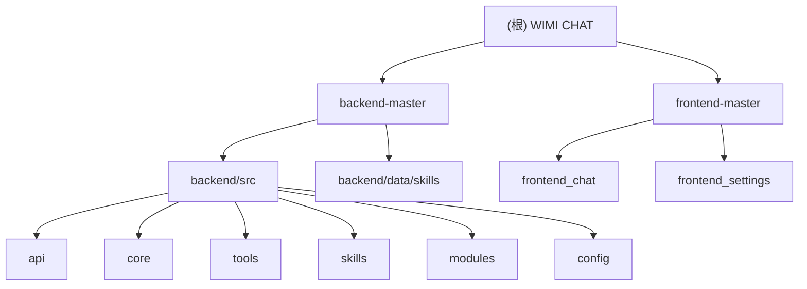

# WIMI CHAT

## 项目愿景

WIMI CHAT 是一个支持 CLI 和 Web 双模式的 AI 对话应用，通过集成 OpenAI 兼容 API 实现大模型支持工具调用、技能系统、SSE 流式响应，为 Claude 等 LLM 提供结构化的工具执行能力。

## 架构总览



## 模块索引

| 模块 | 路径 | 职责 |
|------|------|------|
| **backend** | `backend-master/backend/` | FastAPI 后端服务，提供 LLM 客户端、工具系统、技能系统 |
| **data/skills** | `backend-master/data/skills/` | 技能数据目录，包含 PDF 处理、订单管理、工作站等领域的技能定义 |
| **frontend_chat** | `frontend-master/frontend_chat/` | Vue 3 聊天前端界面 |
| **frontend_settings** | `frontend-master/frontend_settings/` | Vue 3 设置前端界面 |

## 运行与开发

### 环境要求

- Python >= 3.9
- Node.js >= 18
- pnpm >= 8 (前端包管理)
- FastAPI >= 0.109.0
- Uvicorn >= 0.27.0
- OpenAI Python SDK >= 1.0.0

### 启动后端

```bash
cd backend-master/backend

# 安装依赖
pip install -r requirements.txt

# Web 模式（默认，端口 8000）
python -m src --mode web

# CLI 模式
python -m src --mode cli

# 指定端口
python -m src --port 8080
```

### 启动前端

#### 聊天前端 (frontend_chat)

```bash
cd frontend-master/frontend_chat

# 安装依赖
pnpm install

# 开发模式（连接真实后端）
pnpm dev

# Mock 模式开发
pnpm dev:mock
```

#### 设置前端 (frontend_settings)

```bash
cd frontend-master/frontend_settings

# 安装依赖
pnpm install

# 开发模式
pnpm dev

# Mock 模式
pnpm dev:mock
```

### 前后端联调

```bash
# 终端 1: 启动后端
cd backend-master/backend && python -m src --web

# 终端 2: 启动前端
cd frontend-master/frontend_chat && pnpm dev
```

访问 http://localhost:3000 (前端开发)

## 配置

主配置文件位于 `backend-master/config.yaml`，包含：

- **openai**: OpenAI API 配置（api_base, api_key, model）
- **qwen**: 阿里云 Qwen API 配置
- **llm**: LLM 提供商选择（provider: openai/qwen）
- **tools**: 允许的工具列表、最大调用次数
- **server**: 服务 host 和 port

## 测试策略

- 后端测试位于 `backend-master/backend/tests/`
- 技能测试位于 `backend-master/data/skills/pdf/scripts/`
- 建议为 backend 核心模块（client.py、tools、skills）补充单元测试

## 编码规范

### Python 规范

- 使用 Black 格式化（line-length: 100）
- 使用 isort 导入排序（profile: black）
- 使用 flake8 代码检查
- Python >= 3.9 语法
- 使用 Google 风格 docstring

### 前端规范

- Vue 3 + TypeScript + Composition API
- 使用 Vite 构建
- Element Plus UI 组件库
- Pinia 状态管理

## AI 使用指引

### 工具系统

项目实现了可扩展的工具系统：

1. **工具注册表** (`backend-master/backend/src/tools/registry.py`): 管理所有工具的注册和执行
2. **工具基类** (`backend-master/backend/src/tools/base.py`): `BaseTool` 抽象类，所有工具必须继承
3. **内置工具** (`backend-master/backend/src/tools/builtins/`):
   - `bash_tool`: 执行 Bash 命令
   - `datetime_tool`: 日期时间操作
   - `calculator_tool`: 计算器
   - `read_file_tool`: 读取文件
   - `skill_tool`: 技能调用

### 技能系统

技能是预定义的上下文内容，支持占位符替换：

- 技能文件格式：`SKILL.md`（支持 YAML frontmatter）
- 技能目录：`data/skills/{skill_name}/`
- 技能调用：`skill` 工具可动态加载技能内容

### API 接口

- **POST `/api/chat`**: 同步聊天
- **GET `/api/chat/stream`**: SSE 流式聊天
- **GET `/api/health`**: 健康检查

## 变更记录 (Changelog)

| 时间戳 | 操作 | 说明 |
|--------|------|------|
| 2026-02-03 11:32:16 | 初始化 | 首次生成 AI 上下文文档 |
| 2026-02-17 22:00:00 | 更新 | 更新项目结构，添加前端模块说明，更名为 WIMI CHAT |
| 2026-02-26 00:00:00 | 更新 | 统一 CLAUDE.md 文件格式和内容 |
