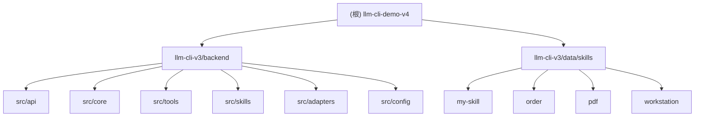

# LLM CLI Demo V4

## 项目愿景

LLM CLI V3 是一个支持 CLI 和 Web 双模式的 AI 对话应用，通过集成 OpenAI 兼容 API 实现大语言模型交互。该项目支持工具调用、技能系统、SSE 流式响应，为 Claude 等 LLM 提供结构化的工具执行能力。

## 架构总览



## 模块索引

| 模块 | 路径 | 职责 |
|------|------|------|
| **backend** | `llm-cli-v3/backend/` | 后端服务核心，提供 FastAPI Web 服务、LLM 客户端、工具系统、技能系统 |
| **data/skills** | `llm-cli-v3/data/skills/` | 技能数据目录，包含 PDF 处理、订单管理、工作站等领域的技能定义 |

## 运行与开发

### 环境要求

- Python >= 3.9
- FastAPI >= 0.109.0
- Uvicorn >= 0.27.0
- OpenAI Python SDK >= 1.0.0

### 启动方式

```bash
# Web 模式（默认，端口 8000）
python -m src --mode web

# CLI 模式
python -m src --mode cli

# 或使用短参数
python -m src --web
python -m src --cli
```

### 配置

主配置文件位于项目根目录 `config.yaml`，包含：

- **openai**: API URL、密钥、模型配置
- **tools**: 允许的工具列表、最大调用次数
- **cli**: 用户前缀、AI 前缀、退出命令
- **system_metadata**: 系统元数据

## 测试策略

- 测试文件较少，仅在 `llm-cli-v3/data/skills/pdf/scripts/` 目录下有 1 个测试文件
- 建议为 backend 核心模块（client.py、tools、skills）补充单元测试

## 编码规范

- 使用 Black 格式化（line-length: 100）
- 使用 isort 导入排序（profile: black）
- 使用 flake8 代码检查
- Python >= 3.9 语法

## AI 使用指引

### 工具系统

项目实现了可扩展的工具系统：

1. **工具注册表** (`src/tools/registry.py`): 管理所有工具的注册和执行
2. **工具基类** (`src/tools/base.py`): `BaseTool` 抽象类，所有工具必须继承
3. **内置工具** (`src/tools/builtins/`):
   - `bash_tool`: 执行 Bash 命令
   - `datetime_tool`: 日期时间操作
   - `calculator_tool`: 计算器
   - `read_file_tool`: 读取文件
   - `skill_tool`: 技能调用

### 技能系统

技能是预定义的上下文内容，支持占位符替换：

- 技能文件格式：`SKILL.md`（支持 YAML frontmatter）
- 技能目录：`data/skills/{skill_name}/`
- 技能调用：`skill` 工具可动态加载技能内容

### API 接口

- **POST `/chat`**: 同步聊天
- **GET `/chat/stream`**: SSE 流式聊天
- **GET `/health`**: 健康检查

## 变更记录 (Changelog)

| 时间戳 | 操作 | 说明 |
|--------|------|------|
| 2026-02-03 11:32:16 | 初始化 | 首次生成 AI 上下文文档 |
