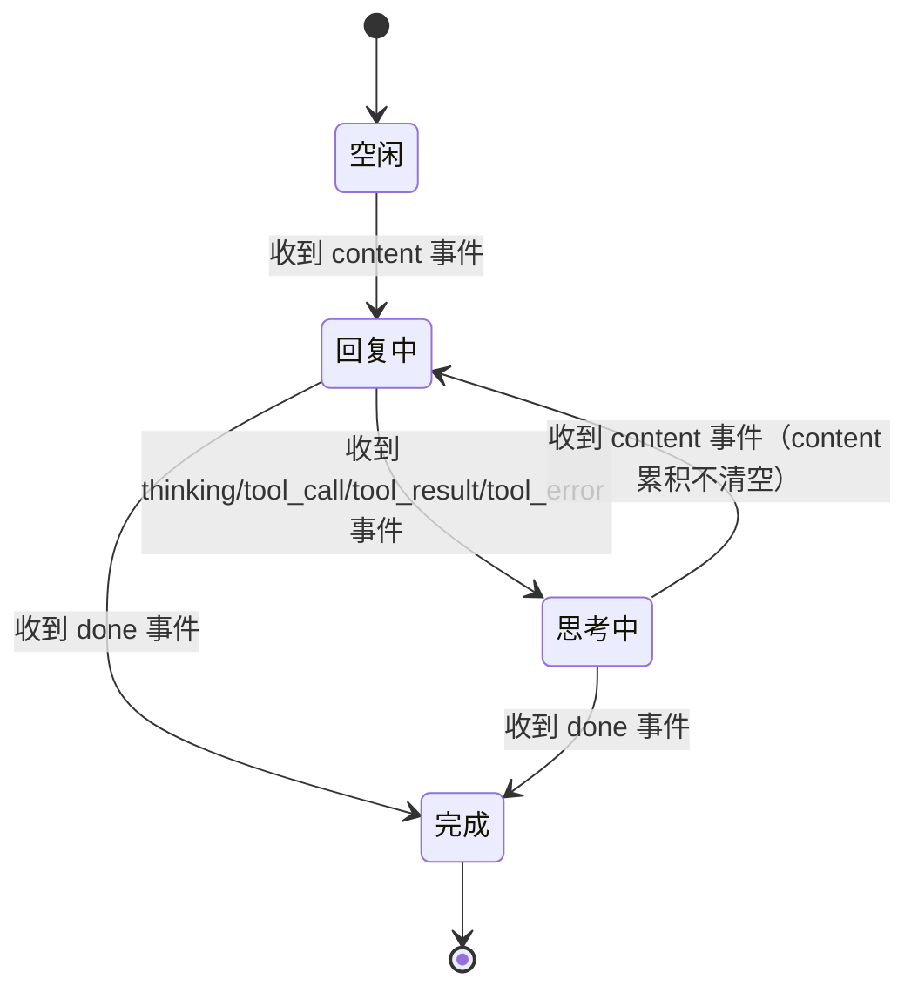

# Vue 前端聊天窗口对接文档

> **后端服务地址**：`http://localhost:8000`（默认配置）
> **文档版本**：1.2.0
> **最后更新**：2026-02-03

---

## 目录

1. [API 接口规范](#1-api-接口规范)
2. [核心 Hook 设计](#2-核心-hook-设计)
3. [UI 原型与交互设计](#3-ui-原型与交互设计)
4. [完整代码示例](#4-完整代码示例)
5. [错误处理与边界情况](#5-错误处理与边界情况)

---

## 1. API 接口规范

### 1.1 同步聊天接口

**端点**：`POST /chat`

**请求体**：

```typescript
interface ChatRequest {
  message: string;  // 用户消息，必填
}
```

**响应格式**：

```typescript
interface ChatResponse {
  success: boolean;   // 是否成功
  response: string;   // AI 回复内容
  tool_calls?: any[]; // 工具调用历史（可选）
}
```

### 1.2 SSE 流式聊天接口

**端点**：`GET /chat/stream?message=xxx`

**请求参数**：

| 参数 | 类型 | 必填 | 描述 |
|------|------|------|------|
| message | string | 是 | 用户消息，需 URL 编码 |

**响应格式**：Server-Sent Events (SSE) 流

### 1.3 SSE 事件类型

| 事件类型 | 描述 | 数据格式 |
|----------|------|----------|
| `content` | AI 响应内容片段 | 字符串 |
| `tool_call` | 工具调用触发 | JSON 字符串 |
| `tool_result` | 工具执行结果 | JSON 字符串 |
| `tool_error` | 工具执行错误 | JSON 字符串 |
| `thinking` | 思考状态 | JSON 字符串 |
| `done` | 流结束 | 空 |
| `error` | 错误 | `{message}` |

---

## 2. 核心 Hook 设计

### 2.1 依赖安装

```bash
npm install axios
```

### 2.2 消息数据结构

```typescript
interface Message {
  id: string;
  role: 'user' | 'assistant';
  content: string;              // content 区域内容（累积，不清空）
  timestamp: number;
  isThinking: boolean;          // 是否处于 thinking 状态
  thinkingLog: ThinkingLog[];   // 思考过程日志（调试用）
}

interface ThinkingLog {
  timestamp: number;            // 事件时间戳
  eventType: string;            // 事件类型
  rawData: string;              // 原始 data 数据（未解析）
}
```

### 2.3 useChat Hook

```typescript
// hooks/useChat.ts
import { ref, reactive, computed } from 'vue';

interface ChatState {
  isLoading: boolean;
  isStreaming: boolean;
  error: string | null;
}

export function useChat(baseUrl = 'http://localhost:8000') {
  const messages = ref<Message[]>([]);
  const state = reactive<ChatState>({
    isLoading: false,
    isStreaming: false,
    error: null,
  });

  const generateId = () => Date.now().toString(36) + Math.random().toString(36).substr(2);

  const addMessage = (role: Message['role']) => {
    const msg: Message = {
      id: generateId(),
      role,
      content: '',
      timestamp: Date.now(),
      isThinking: false,
      thinkingLog: [],
    };
    messages.value.push(msg);
    return msg.id;
  };

  const streamMessage = async (message: string): Promise<void> => {
    if (state.isLoading || state.isStreaming) return;

    // 添加用户消息
    addMessage('user');
    state.isLoading = true;
    state.isStreaming = true;
    state.error = null;

    // 创建助手消息占位
    const assistantMsgId = addMessage('assistant');

    try {
      const encodedMessage = encodeURIComponent(message);
      const response = await fetch(`${baseUrl}/chat/stream?message=${encodedMessage}`);

      if (!response.ok) {
        throw new Error(`HTTP ${response.status}`);
      }

      const reader = response.body?.getReader();
      if (!reader) throw new Error('无法读取响应流');

      const decoder = new TextDecoder();
      let buffer = '';

      while (true) {
        const { done, value } = await reader.read();
        if (done) break;

        buffer += decoder.decode(value, { stream: true });
        const lines = buffer.split('\n\n');
        buffer = lines.pop() || '';

        for (const line of lines) {
          if (line.startsWith('event:')) {
            const eventType = line.replace('event:', '').trim();
            const dataMatch = line.match(/data:(.*)/);
            const data = dataMatch ? dataMatch[1].trim() : '';

            handleSSERecord(eventType, data, assistantMsgId);
          }
        }
      }
    } catch (err: any) {
      state.error = err.message || '流式请求失败';
      const lastMsg = messages.value.find(m => m.id === assistantMsgId);
      if (lastMsg) {
        lastMsg.content += `\n错误: ${state.error}`;
        lastMsg.isThinking = false;
      }
    } finally {
      state.isLoading = false;
      state.isStreaming = false;
    }
  };

  // SSE 事件处理
  const handleSSERecord = (eventType: string, data: string, msgId: string) => {
    const lastMsg = messages.value.find(m => m.id === msgId);
    if (!lastMsg) return;

    // 记录所有 thinking/tool_call/tool_result/tool_error 事件到日志
    if (['thinking', 'tool_call', 'tool_result', 'tool_error'].includes(eventType)) {
      lastMsg.thinkingLog.push({
        timestamp: Date.now(),
        eventType,
        rawData: data,
      });
      // 进入 thinking 状态
      lastMsg.isThinking = true;
    }

    switch (eventType) {
      case 'content':
        // content 事件：累积内容，关闭 thinking 状态
        lastMsg.isThinking = false;
        lastMsg.content += data;  // 累积内容，不清空
        break;

      case 'thinking':
        // thinking 事件：保持 thinking 状态，content 累积不清空
        lastMsg.isThinking = true;
        break;

      case 'tool_call':
      case 'tool_result':
      case 'tool_error':
        // 工具相关事件：保持 thinking 状态，日志已记录
        lastMsg.isThinking = true;
        // content 保持累积，不清空
        break;

      case 'done':
        // 流结束：关闭 thinking 状态
        lastMsg.isThinking = false;
        break;

      case 'error':
        lastMsg.isThinking = false;
        lastMsg.content += `\n错误: ${data}`;
        break;
    }
  };

  const clearMessages = () => {
    messages.value = [];
  };

  return {
    messages: computed(() => messages.value),
    state: computed(() => ({
      isLoading: state.isLoading,
      isStreaming: state.isStreaming,
      error: state.error,
    })),
    streamMessage,
    clearMessages,
  };
}
```

---

## 3. UI 原型与交互设计

### 3.1 消息组件布局结构

```
+-------------------------------------------------------------+
| 用户消息气泡 (右侧)                                           |
| "帮我查询北京和上海的天气，分别列出"                          |
+-------------------------------------------------------------+
| AI 消息容器 (左侧)                                           |
|  +-----------------------------------------------------+   |
|  | [Content 区域 - 打字机效果，累积显示]               |   |
|  | "北京：今天天气晴朗，气温15-25°C。"                 |   |
|  | "上海：多云转晴，气温18-22°C。"                    |   |
|  | （content 累积，不清空）                           |   |
|  +-----------------------------------------------------+   |
|                                                              |
|  +-----------------------------------------------------+   |
|  | [Thinking 区域 - 固定高度 120px，可滚动]            |   |
|  |  +-----------------------------------------------+  |   |
|  |  | [10:32:16] thinking                          |  |   |
|  |  | {"status":"analyzing"}                       |  |   |
|  |  +-----------------------------------------------+  |   |
|  |  | [10:32:17] tool_call                        |  |   |
|  |  | {"function":{"name":"get_weather"...}       |  |   |
|  |  +-----------------------------------------------+  |   |
|  |  | [10:32:18] tool_result                       |  |   |
|  |  | {"tool_name":"get_weather","result":"..."}   |  |   |
|  |  +-----------------------------------------------+  |   |
|  +-----------------------------------------------------+   |
+-------------------------------------------------------------+
```

### 3.2 交互规则说明

> **核心原则**：content 内容**累积不清空**，thinking 区域独立显示调试日志

| 事件 | Content 区域 | Thinking 区域 | 说明 |
|------|--------------|---------------|------|
| `thinking` | 保持累积 | 显示日志 | 进入思考状态，content 不受影响 |
| `content` | 累积追加 | 隐藏 | 继续回复，content 累加 |
| `tool_call` | 保持累积 | 追加日志 | 工具调用，content 不受影响 |
| `tool_result` | 保持累积 | 追加日志 | 工具返回，content 不受影响 |
| `tool_error` | 保持累积 | 追加日志 | 工具错误，content 不受影响 |
| `done` | 保持 | 隐藏 | 流结束 |

### 3.3 多轮工具调用事件流示例

```
事件序列：content -> tool_call -> tool_result -> content -> tool_call -> tool_result -> content

时间线：
┌─────────────────────────────────────────────────────────────────────┐
│                                                                     │
│  [T1] content: "首先"                                               │
│       Content: "首先"                                               │
│       Thinking: (隐藏)                                               │
│                                                                     │
│  [T2] tool_call: {"function":{"name":"get_weather"...}}            │
│       Content: "首先" (保持)                                        │
│       Thinking: 显示 [{"event":"tool_call","data":"..."}]           │
│                                                                     │
│  [T3] tool_result: {"tool_name":"get_weather","result":"晴"}        │
│       Content: "首先" (保持)                                        │
│       Thinking: 追加 [{"event":"tool_result","data":"..."}]          │
│                                                                     │
│  [T4] content: "北京天气晴朗，"                                     │
│       Content: "首先北京天气晴朗，" (累积)                           │
│       Thinking: (隐藏)                                               │
│                                                                     │
│  [T5] tool_call: {"function":{"name":"get_weather"...}}            │
│       Content: "首先北京天气晴朗，" (保持)                           │
│       Thinking: 显示新的一轮调试日志                                  │
│                                                                     │
│  [T6] tool_result: {"tool_name":"get_weather","result":"多云"}      │
│       Content: "首先北京天气晴朗，" (保持)                           │
│       Thinking: 追加日志                                             │
│                                                                     │
│  [T7] content: "上海多云。"                                          │
│       Content: "首先北京天气晴朗，上海多云。" (完整累积)              │
│       Thinking: (隐藏)                                               │
│                                                                     │
│  [T8] done                                                         │
│       最终显示完整回复                                               │
│                                                                     │
└─────────────────────────────────────────────────────────────────────┘
```

### 3.4 原型草图

```
+--------------------------------------------------------------------+
|  AI 助手                                              [清空对话]  |
+--------------------------------------------------------------------+
|                                                                     |
|  +----------------------+                                           |
|  | 用户                 |                                           |
|  | 帮我查询北京和上海的天气 |                                       |
|  +----------------------+                                           |
|                                                                     |
|  +----------------------+                                           |
|  | AI                   |                                           |
|  | +------------------+ |                                           |
|  | | 北京：今天天气晴朗，| |  <- Content 区域（打字机，累积）        |
|  | | 气温15-25°C。     | |                                           |
|  | | 上海：多云转晴，   | |                                           |
|  | | 气温18-22°C。     | |                                           |
|  | +------------------+ |                                           |
|  |                      |                                           |
|  | +------------------+ |                                           |
|  | | [14:02:15]       | |  <- Thinking 区域（固定高度 120px）       |
|  | | thinking         | |                                           |
|  | | {"status":"..."} | |                                           |
|  | | ---------------- | |                                           |
|  | | [14:02:16]       | |                                           |
|  | | tool_call        | |                                           |
|  | | {"id":0,...}     | |                                           |
|  | | ---------------- | |                                           |
|  | | [14:02:17]       | |                                           |
|  | | tool_result      | |                                           |
|  | | {"tool_name":...}| |                                           |
|  | +------------------+ |                                           |
|  +----------------------+                                           |
|                                                                     |
|  +----------------------------------------------------------------+ |
|  | 输入消息...                                         [+]       | |
|  +----------------------------------------------------------------+ |
+--------------------------------------------------------------------+
```

### 3.5 交互状态流转图



### 3.6 Content 区域与 Thinking 区域并行逻辑

```
核心设计：content 和 thinking 并行存在，不互斥

┌─────────────────────────────────────────────────────────────────┐
│  事件类型   │ Content 区域        │ Thinking 区域              │
├─────────────────────────────────────────────────────────────────┤
│  content   │ 累积追加，不清空      │ 隐藏（若之前显示）          │
│  thinking  │ 保持不变              │ 显示日志                   │
│  tool_call │ 保持不变              │ 追加日志                   │
│  tool_result│ 保持不变             │ 追加日志                   │
│  done      │ 保持最终结果          │ 隐藏                       │
└─────────────────────────────────────────────────────────────────┘

优势：
- 多轮工具调用时，content 内容不会丢失
- 用户可以同时看到 AI 回复和调试信息
- 交互更加流畅自然
```

---

## 4. 完整代码示例

### 4.1 消息列表组件 (MessageList.vue)

```vue
<template>
  <div class="message-list" ref="containerRef">
    <div
      v-for="msg in messages"
      :key="msg.id"
      :class="['message', msg.role]"
    >
      <!-- 用户消息 -->
      <template v-if="msg.role === 'user'">
        <div class="message-content">
          {{ msg.content }}
        </div>
      </template>

      <!-- AI 消息 -->
      <template v-else>
        <div class="ai-message">
          <!-- Content 区域：打字机效果 -->
          <div class="content-area">
            <template v-if="msg.isThinking && !msg.content">
              <div class="typing-indicator">
                <span class="dot"></span>
                <span class="dot"></span>
                <span class="dot"></span>
                <span class="typing-text">思考中...</span>
              </div>
            </template>
            <template v-else>
              <div class="ai-content" ref="contentRef">
                {{ msg.content }}
              </div>
            </template>
          </div>

          <!-- Thinking 区域：仅在 thinking 状态时显示 -->
          <div
            v-if="msg.isThinking && msg.thinkingLog.length > 0"
            class="thinking-area"
          >
            <div class="thinking-header">
              <span class="thinking-icon">🧠</span>
              <span>思考过程</span>
              <span class="log-count">({{ msg.thinkingLog.length }} 条)</span>
            </div>
            <div class="thinking-log">
              <div
                v-for="(log, idx) in msg.thinkingLog"
                :key="idx"
                class="log-item"
              >
                <span class="log-time">{{ formatTime(log.timestamp) }}</span>
                <span class="log-event">{{ log.eventType }}</span>
                <pre class="log-data">{{ log.rawData }}</pre>
              </div>
            </div>
          </div>

          <!-- 完成后可折叠显示思考日志 -->
          <div
            v-if="!msg.isThinking && msg.thinkingLog.length > 0"
            class="thinking-collapsed"
          >
            <details>
              <summary>查看思考过程 ({{ msg.thinkingLog.length }} 条)</summary>
              <div class="thinking-log collapsed">
                <div
                  v-for="(log, idx) in msg.thinkingLog"
                  :key="idx"
                  class="log-item"
                >
                  <span class="log-time">{{ formatTime(log.timestamp) }}</span>
                  <span class="log-event">{{ log.eventType }}</span>
                  <pre class="log-data">{{ log.rawData }}</pre>
                </div>
              </div>
            </details>
          </div>
        </div>
      </template>
    </div>
  </div>
</template>

<script setup lang="ts">
import { ref, watch, nextTick, computed } from 'vue';

interface Message {
  id: string;
  role: 'user' | 'assistant';
  content: string;
  timestamp: number;
  isThinking: boolean;
  thinkingLog: {
    timestamp: number;
    eventType: string;
    rawData: string;
  }[];
}

const props = defineProps<{
  messages: Message[];
}>();

const containerRef = ref<HTMLElement>();
const contentRef = ref<HTMLElement[]>([]);

// 自动滚动到底部
watch(
  () => props.messages.length,
  () => {
    nextTick(() => {
      if (containerRef.value) {
        containerRef.value.scrollTop = containerRef.value.scrollHeight;
      }
    });
  }
);

// 格式化时间
const formatTime = (timestamp: number) => {
  const date = new Date(timestamp);
  return date.toLocaleTimeString('zh-CN', {
    hour12: false,
    hour: '2-digit',
    minute: '2-digit',
    second: '2-digit',
  });
};
</script>

<style scoped>
.message-list {
  flex: 1;
  overflow-y: auto;
  padding: 16px;
}

.message {
  margin-bottom: 16px;
  display: flex;
}

.message.user {
  justify-content: flex-end;
}

.message.assistant {
  justify-content: flex-start;
}

.message-content {
  max-width: 80%;
  padding: 12px 16px;
  border-radius: 12px;
}

.message.user .message-content {
  background: #007aff;
  color: white;
}

.ai-message {
  max-width: 85%;
  display: flex;
  flex-direction: column;
  gap: 8px;
}

/* Content 区域 */
.content-area {
  padding: 12px 16px;
  background: #f0f0f0;
  border-radius: 12px;
  color: #333;
}

.typing-indicator {
  display: flex;
  align-items: center;
  gap: 4px;
  color: #666;
}

.typing-indicator .dot {
  width: 8px;
  height: 8px;
  background: #999;
  border-radius: 50%;
  animation: bounce 1.4s infinite ease-in-out;
}

.typing-indicator .dot:nth-child(1) { animation-delay: 0s; }
.typing-indicator .dot:nth-child(2) { animation-delay: 0.2s; }
.typing-indicator .dot:nth-child(3) { animation-delay: 0.4s; }

@keyframes bounce {
  0%, 80%, 100% { transform: scale(0); }
  40% { transform: scale(1); }
}

.typing-text {
  margin-left: 8px;
  font-size: 13px;
}

.ai-content {
  line-height: 1.6;
  white-space: pre-wrap;
  word-break: break-word;
}

/* Thinking 区域 */
.thinking-area {
  background: #1e1e2e;
  border-radius: 8px;
  overflow: hidden;
}

.thinking-header {
  display: flex;
  align-items: center;
  gap: 6px;
  padding: 8px 12px;
  background: #2d2d3d;
  color: #a6accd;
  font-size: 12px;
  font-weight: 500;
}

.log-count {
  color: #666;
  font-weight: normal;
}

.thinking-log {
  max-height: 120px;
  overflow-y: auto;
  padding: 8px;
}

.log-item {
  padding: 6px 8px;
  margin-bottom: 4px;
  background: #252535;
  border-radius: 4px;
  font-size: 11px;
}

.log-time {
  color: #6c7086;
  margin-right: 8px;
}

.log-event {
  color: #89b4fa;
  font-weight: 500;
}

.log-data {
  margin: 6px 0 0 0;
  padding: 6px;
  background: #1a1a2e;
  border-radius: 4px;
  color: #a6adc8;
  white-space: pre-wrap;
  word-break: break-all;
  font-family: 'Monaco', 'Menlo', monospace;
  font-size: 10px;
}

/* 折叠状态 */
.thinking-collapsed {
  font-size: 12px;
}

.thinking-collapsed details {
  background: #f5f5f5;
  border-radius: 6px;
  padding: 6px 12px;
}

.thinking-collapsed summary {
  cursor: pointer;
  color: #666;
  list-style: none;
}

.thinking-collapsed summary::-webkit-details-marker {
  display: none;
}

.thinking-collapsed summary::before {
  content: '▶';
  display: inline-block;
  margin-right: 6px;
  font-size: 10px;
  transition: transform 0.2s;
}

.thinking-collapsed details[open] summary::before {
  transform: rotate(90deg);
}

.thinking-collapsed .collapsed {
  margin-top: 8px;
  max-height: 200px;
  overflow-y: auto;
}
</style>
```

### 4.2 输入框组件 (ChatInput.vue)

```vue
<template>
  <div class="chat-input">
    <div class="input-container">
      <textarea
        v-model="inputMessage"
        @keydown.enter.exact.prevent="send"
        :disabled="state.isLoading || state.isStreaming"
        placeholder="输入消息..."
        rows="1"
        ref="textareaRef"
      ></textarea>
      <button
        @click="send"
        :disabled="!canSend"
        class="send-btn"
      >
        <span v-if="state.isStreaming">⏹</span>
        <span v-else>➤</span>
      </button>
    </div>
  </div>
</template>

<script setup lang="ts">
import { ref, computed, watch } from 'vue';

interface State {
  isLoading: boolean;
  isStreaming: boolean;
  error: string | null;
}

const props = defineProps<{
  state: State;
}>();

const emit = defineEmits<{
  (e: 'send', message: string): void;
}>();

const inputMessage = ref('');
const textareaRef = ref<HTMLTextAreaElement>();

const canSend = computed(() => {
  return inputMessage.value.trim() && !props.state.isLoading && !props.state.isStreaming;
});

const send = () => {
  if (!canSend.value) return;
  emit('send', inputMessage.value.trim());
  inputMessage.value = '';
};

// 自动调整高度
watch(inputMessage, () => {
  if (textareaRef.value) {
    textareaRef.value.style.height = 'auto';
    textareaRef.value.style.height = Math.min(textareaRef.value.scrollHeight, 120) + 'px';
  }
});
</script>

<style scoped>
.chat-input {
  padding: 16px;
  background: white;
  border-top: 1px solid #e0e0e0;
}

.input-container {
  display: flex;
  align-items: flex-end;
  gap: 8px;
  background: #f5f5f5;
  border-radius: 24px;
  padding: 8px 12px;
}

textarea {
  flex: 1;
  border: none;
  background: transparent;
  resize: none;
  outline: none;
  font-size: 14px;
  line-height: 1.5;
  max-height: 120px;
  padding: 6px 0;
}

.send-btn {
  width: 36px;
  height: 36px;
  border-radius: 50%;
  border: none;
  background: #007aff;
  color: white;
  cursor: pointer;
  display: flex;
  align-items: center;
  justify-content: center;
  font-size: 16px;
  transition: background 0.2s;
}

.send-btn:hover:not(:disabled) {
  background: #0056b3;
}

.send-btn:disabled {
  background: #ccc;
  cursor: not-allowed;
}
</style>
```

### 4.3 主组件 (ChatWindow.vue)

```vue
<template>
  <div class="chat-window">
    <div class="chat-header">
      <h2>AI 助手</h2>
      <div :class="['status', { connected: state.isStreaming }]">
        <span class="status-dot"></span>
        {{ getStatusText() }}
      </div>
      <button @click="clearMessages" class="clear-btn">清空对话</button>
    </div>

    <MessageList :messages="messages" />

    <ChatInput :state="state" @send="handleSend" />

    <div v-if="state.error" class="error-toast">
      {{ state.error }}
      <button @click="state.error = null">×</button>
    </div>
  </div>
</template>

<script setup lang="ts">
import MessageList from './MessageList.vue';
import ChatInput from './ChatInput.vue';
import { useChat } from '../hooks/useChat';

const baseUrl = 'http://localhost:8000';
const { messages, state, streamMessage, clearMessages } = useChat(baseUrl);

const handleSend = async (message: string) => {
  await streamMessage(message);
};

const getStatusText = () => {
  if (state.isStreaming) return '思考中...';
  if (state.isLoading) return '加载中...';
  return '就绪';
};
</script>

<style scoped>
.chat-window {
  display: flex;
  flex-direction: column;
  height: 100vh;
  max-width: 900px;
  margin: 0 auto;
  background: white;
  position: relative;
}

.chat-header {
  display: flex;
  justify-content: space-between;
  align-items: center;
  padding: 16px;
  border-bottom: 1px solid #e0e0e0;
}

.chat-header h2 {
  margin: 0;
  font-size: 18px;
}

.status {
  display: flex;
  align-items: center;
  gap: 6px;
  font-size: 12px;
  color: #999;
}

.status-dot {
  width: 8px;
  height: 8px;
  border-radius: 50%;
  background: #ccc;
}

.status.connected .status-dot {
  background: #4caf50;
  animation: pulse 1.5s infinite;
}

@keyframes pulse {
  0%, 100% { opacity: 1; }
  50% { opacity: 0.5; }
}

.clear-btn {
  padding: 6px 12px;
  border: 1px solid #e0e0e0;
  background: white;
  border-radius: 4px;
  cursor: pointer;
  font-size: 13px;
}

.clear-btn:hover {
  background: #f5f5f5;
}

.error-toast {
  position: absolute;
  bottom: 80px;
  left: 50%;
  transform: translateX(-50%);
  background: #ff4444;
  color: white;
  padding: 10px 16px;
  border-radius: 8px;
  display: flex;
  align-items: center;
  gap: 8px;
  font-size: 14px;
}

.error-toast button {
  background: transparent;
  border: none;
  color: white;
  font-size: 18px;
  cursor: pointer;
}
</style>
```

---

## 5. 错误处理与边界情况

### 5.1 核心逻辑

```typescript
// 事件处理核心逻辑 - content 累积不清空
const handleSSERecord = (eventType: string, data: string, msgId: string) => {
  const lastMsg = messages.value.find(m => m.id === msgId);
  if (!lastMsg) return;

  // 工具调用相关事件记录到日志（用于调试）
  if (['thinking', 'tool_call', 'tool_result', 'tool_error'].includes(eventType)) {
    lastMsg.thinkingLog.push({
      timestamp: Date.now(),
      eventType,
      rawData: data,  // 直接存储原始 data，不解析
    });
    lastMsg.isThinking = true;
  }

  switch (eventType) {
    case 'content':
      // content 累积，不清空
      lastMsg.isThinking = false;
      lastMsg.content += data;
      break;

    case 'thinking':
      // content 保持不变
      lastMsg.isThinking = true;
      break;

    case 'done':
      lastMsg.isThinking = false;
      break;

    case 'error':
      lastMsg.isThinking = false;
      lastMsg.content += `\n错误: ${data}`;
      break;
  }
};
```

### 5.2 边界情况处理

| 场景 | 处理方式 |
|------|----------|
| 空消息 | 前端拦截，提示"消息不能为空" |
| SSE 连接中断 | 自动重连，显示错误状态 |
| 工具调用错误 | 记录到 thinkingLog，content 保持累积 |
| 页面关闭 | 断开 SSE 连接 |
| 后端不可用 | 显示错误提示 |
| 流中断无 done | 超时后关闭连接 |
| 多轮工具调用 | content 持续累积，不被清除 |

### 5.3 调试模式

Thinking 区域的设计目标是用于**开发调试**，生产环境可配置是否显示：

```typescript
// 配置是否显示调试日志
const config = {
  showDebugLog: import.meta.env.DEV,  // 仅开发环境显示
};
```

---

## 附录

### A. 事件处理流程图

```
SSE 事件流处理（content 累积不清空）
═══════════════════════════════════════════════════════════════

┌─────────────┐
│  收到事件   │
└──────┬──────┘
       │
       ▼
┌──────────────┐
│ 是调试事件?  │ ─── 是 ──→ 记录到 thinkingLog
└──────┬───────┘
       │ 否
       ▼
┌──────────────┐
│ event_type   │
└──────┬───────┘
       │
       ├─ content  ──→ content += data（累积）
       │             isThinking = false
       │
       ├─ thinking ──→ isThinking = true
       │             content 保持不变
       │
       ├─ tool_* ───→ 记录日志，isThinking = true
       │             content 保持不变
       │
       ├─ done ─────→ isThinking = false
       │
       └─ error ────→ content += 错误信息
                       isThinking = false
```

### B. 完整 API 响应时间线（多轮工具调用）

```
[场景]：查询北京和上海天气

[T0] 用户: "帮我查询北京和上海的天气"
[T1] content  → Content: "首先", Thinking: (隐藏)
[T2] tool_call → Content: "首先" (保持), Thinking: 显示日志1
[T3] tool_result → Content: "首先" (保持), Thinking: 追加日志2
[T4] content → Content: "首先北京天气晴朗，", Thinking: 隐藏
[T5] tool_call → Content: "首先北京天气晴朗，" (保持), Thinking: 显示日志3
[T6] tool_result → Content: "首先北京天气晴朗，" (保持), Thinking: 追加日志4
[T7] content → Content: "上海多云转晴。", Thinking: 隐藏
[T8] done → 最终显示完整回复
```

### C. 与旧版本差异对比

| 特性 | v1.0 (旧) | v1.2 (新) |
|------|-----------|-----------|
| content 清空 | 是 | 否 |
| thinking/content 互斥 | 是 | 否 |
| 多轮工具调用 | content 丢失 | content 累积 |
| 交互流畅度 | 一般 | 更流畅 |

---

*文档更新时间: 2026-02-03*
