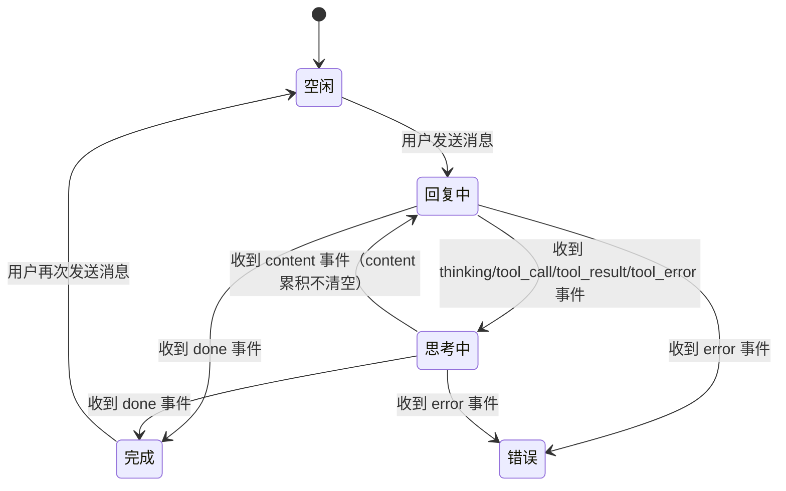

# Vue 聊天窗口 UI 规范文档

> **文档版本**：1.0.0
> **适用项目**：LLM CLI Demo V4
> **前端框架**：Vue 3 + TypeScript
> **最后更新**：2026-02-03

---

## 目录

1. [设计原则与规范](#1-设计原则与规范)
2. [组件设计规范](#2-组件设计规范)
3. [颜色与排版规范](#3-颜色与排版规范)
4. [交互规范](#4-交互规范)
5. [响应式设计要求](#5-响应式设计要求)
6. [可访问性要求](#6-可访问性要求)
7. [附录](#7-附录)

---

## 1. 设计原则与规范

### 1.1 核心设计原则

本聊天窗口 UI 设计遵循以下核心原则，确保用户获得直观、高效的交互体验：

| 原则 | 描述 | 应用场景 |
|------|------|----------|
| **内容可见性** | AI 回复内容累积显示，不被中断 | 流式响应过程中，用户始终可以看到完整回复 |
| **状态透明性** | thinking 状态独立显示调试日志 | 开发调试时清晰追踪 AI 思考过程 |
| **交互流畅性** | Content 与 Thinking 区域并行存在 | 多轮工具调用时保持流畅的用户体验 |
| **即时反馈** | 打字机效果 + 思考指示器 | 让用户感知到 AI 正在响应 |

### 1.2 内容累积策略

**核心规则**：Content 区域内容**累积不清空**，Thinking 区域独立显示调试日志。

```
┌─────────────────────────────────────────────────────────────────────┐
│  事件类型        │ Content 区域              │ Thinking 区域          │
├─────────────────────────────────────────────────────────────────────┤
│  content        │ 累积追加，不清空           │ 隐藏（若之前显示）      │
│  thinking       │ 保持不变                  │ 显示日志               │
│  tool_call      │ 保持不变                  │ 追加日志               │
│  tool_result    │ 保持不变                  │ 追加日志               │
│  tool_error     │ 保持累积                  │ 追加错误日志           │
│  done           │ 保持最终结果              │ 隐藏                   │
└─────────────────────────────────────────────────────────────────────┘
```

**设计理由**：
- 多轮工具调用时，content 内容不会丢失
- 用户可以同时看到 AI 回复和调试信息
- 避免因状态切换导致的视觉跳跃

### 1.3 视觉层次结构

```
┌─────────────────────────────────────────────────────────────────┐
│                        ChatWindow (主容器)                       │
│  ┌───────────────────────────────────────────────────────────┐  │
│  │                      ChatHeader (头部)                     │  │
│  │  [标题] [状态指示器] [清空对话按钮]                         │  │
│  └───────────────────────────────────────────────────────────┘  │
│  ┌───────────────────────────────────────────────────────────┐  │
│  │                    MessageList (消息列表)                  │  │
│  │  ┌─────────────────────────────────────────────────────┐  │  │
│  │  │  Message (单条消息 - 用户右侧对齐)                    │  │  │
│  │  └─────────────────────────────────────────────────────┘  │  │
│  │  ┌─────────────────────────────────────────────────────┐  │  │
│  │  │  Message (单条消息 - AI 左侧对齐)                    │  │  │
│  │  │  ┌───────────────────────────────────────────────┐  │  │  │
│  │  │  │            Content 区域 (回复内容)             │  │  │  │
│  │  │  └───────────────────────────────────────────────┘  │  │  │
│  │  │  ┌───────────────────────────────────────────────┐  │  │  │
│  │  │  │           Thinking 区域 (调试日志)             │  │  │  │
│  │  │  └───────────────────────────────────────────────┘  │  │  │
│  │  └─────────────────────────────────────────────────────┘  │  │
│  └───────────────────────────────────────────────────────────┘  │
│  ┌───────────────────────────────────────────────────────────┐  │
│  │                      ChatInput (输入区域)                  │  │
│  │  [文本域] [发送按钮]                                       │  │
│  └───────────────────────────────────────────────────────────┘  │
└─────────────────────────────────────────────────────────────────┘
```

---

## 2. 组件设计规范

### 2.1 组件架构

```
src/
  components/
    ChatWindow.vue      # 主容器组件
    MessageList.vue     # 消息列表容器
    MessageItem.vue     # 单条消息组件
    ChatInput.vue       # 输入组件
    ThinkingArea.vue    # 思考区域组件（可选拆分）
  hooks/
    useChat.ts          # 聊天逻辑 Hook
    useAutoScroll.ts    # 自动滚动 Hook
```

### 2.2 ChatWindow 组件规范

**职责**：作为聊天窗口的主容器，协调各子组件的展示。

**布局结构**：
```
┌─────────────────────────────────────────────────┐
│ ChatHeader (56px)                               │
├─────────────────────────────────────────────────┤
│ MessageList (flex: 1, overflow-y: auto)         │
├─────────────────────────────────────────────────┤
│ ChatInput (固定高度，底部定位)                   │
└─────────────────────────────────────────────────┘
```

**属性（Props）**：
```typescript
interface ChatWindowProps {
  baseUrl?: string;      // 后端 API 地址，默认 'http://localhost:8000'
  title?: string;        // 标题文本，默认 'AI 助手'
  showDebugLog?: boolean; // 是否显示调试日志，默认开发环境为 true
}
```

**状态（State）**：
```typescript
interface ChatState {
  isLoading: boolean;    // 是否加载中
  isStreaming: boolean;  // 是否流式响应中
  error: string | null;  // 错误信息
}
```

**事件（Emits）**：
| 事件名 | 参数 | 描述 |
|--------|------|------|
| clear | - | 清空对话按钮点击 |
| error | message: string | 发生错误时触发 |

### 2.3 MessageList 组件规范

**职责**：渲染消息列表，支持自动滚动到底部。

**布局要求**：
- `flex: 1` 填充剩余空间
- `overflow-y: auto` 支持垂直滚动
- `padding: 16px` 内边距

**自动滚动规则**：
```typescript
// 当消息数量增加时，自动滚动到底部
watch(
  () => props.messages.length,
  () => {
    nextTick(() => {
      containerRef.value.scrollTop = containerRef.value.scrollHeight;
    });
  }
);
```

### 2.4 MessageItem 组件规范

**职责**：渲染单条消息，根据角色（user/assistant）显示不同样式。

**布局结构**：
```
┌─────────────────────────────────────────────────────────┐
│ 用户消息 (右侧对齐)                                       │
│  +---------------------------------------------------+  │
│  | 消息内容气泡 (蓝色背景，白色文字)                   |  │
│  +---------------------------------------------------+  │
├─────────────────────────────────────────────────────────┤
│ AI 消息 (左侧对齐)                                      │
│  +---------------------------------------------------+  │
│  | Content 区域 (灰色背景，黑色文字)                   |  │
│  +---------------------------------------------------+  │
│  | Thinking 区域 (深色背景，调试日志)                  |  │
│  +---------------------------------------------------+  │
└─────────────────────────────────────────────────────────┘
```

**消息数据结构**：
```typescript
interface Message {
  id: string;                    // 唯一标识
  role: 'user' | 'assistant';    // 角色
  content: string;               // 回复内容
  timestamp: number;             // 时间戳
  isThinking: boolean;           // 是否思考中
  thinkingLog: ThinkingLog[];    // 思考日志
}

interface ThinkingLog {
  timestamp: number;      // 事件时间戳
  eventType: string;      // 事件类型
  rawData: string;        // 原始数据
}
```

### 2.5 ChatInput 组件规范

**职责**：处理用户输入，支持 Enter 发送和自动调整高度。

**布局结构**：
```
┌─────────────────────────────────────────────────────────┐
│ [文本域 - 自动调整高度，最大 120px] [发送按钮 - 圆形]    │
└─────────────────────────────────────────────────────────┘
```

**交互规则**：
- Enter 键发送消息（阻止默认换行行为）
- Shift + Enter 允许换行
- 发送后自动清空输入框
- 禁用状态下不可交互

**自动调整高度逻辑**：
```typescript
watch(inputMessage, () => {
  if (textareaRef.value) {
    textareaRef.value.style.height = 'auto';
    textareaRef.value.style.height = Math.min(textareaRef.value.scrollHeight, 120) + 'px';
  }
});
```

### 2.6 ThinkingArea 组件规范

**职责**：渲染 AI 思考过程的调试日志。

**布局要求**：
- 固定高度 120px
- `overflow-y: auto` 支持滚动
- 深色背景 (#1e1e2e) 区分于主内容区

**日志项结构**：
```
[时间戳] [事件类型]
{
  "原始数据 JSON"
}
```

---

## 3. 颜色与排版规范

### 3.1 颜色系统

#### 3.1.1 主色板

| 角色 | 颜色值 | 用途 |
|------|--------|------|
| 用户消息背景 | `#007aff` | 消息气泡背景 |
| 用户消息文字 | `#ffffff` | 消息气泡文字 |
| AI 消息背景 | `#f0f0f0` | Content 区域背景 |
| AI 消息文字 | `#333333` | Content 区域文字 |
| 思考区域背景 | `#1e1e2e` | Thinking 区域深色背景 |
| 思考区域文字 | `#a6accd` | Thinking 区域主文字 |
| 事件类型高亮 | `#89b4fa` | 日志事件类型 |
| 时间戳颜色 | `#6c7086` | 日志时间戳 |
| JSON 数据背景 | `#1a1a2e` | JSON 数据块背景 |
| JSON 数据文字 | `#a6adc8` | JSON 数据文字 |

#### 3.1.2 状态颜色

| 状态 | 颜色值 | 用途 |
|------|--------|------|
| 就绪状态 | `#cccccc` | 状态指示点 |
| 连接中/思考中 | `#4caf50` | 状态指示点 + 脉冲动画 |
| 加载中 | `#ff9800` | 思考中状态文字 |
| 错误 | `#ff4444` | 错误提示背景 |
| 边框/分隔线 | `#e0e0e0` | 分隔线颜色 |

#### 3.1.3 Thinking 区域色板

| 元素 | 颜色值 | 用途 |
|------|--------|------|
| 头部背景 | `#2d2d3d` | Thinking 区域头部 |
| 日志项背景 | `#252535` | 单条日志背景 |
| 边框色 | `#3d3d4d` | 组件边框 |

### 3.2 排版系统

#### 3.2.1 字体规范

| 元素 | 字体家族 | 字号 | 字重 | 行高 |
|------|----------|------|------|------|
| 标题 (h2) | System UI | 18px | 600 | 1.4 |
| 消息内容 | System UI | 14px | 400 | 1.6 |
| 日志时间戳 | System UI | 11px | 400 | 1.5 |
| 日志事件类型 | System UI | 11px | 500 | 1.5 |
| JSON 数据 | Monaco/Menlo | 10px | 400 | 1.5 |
| 占位符/提示文字 | System UI | 13px | 400 | 1.5 |
| 输入框文字 | System UI | 14px | 400 | 1.5 |
| 按钮文字 | System UI | 13px | 400 | 1.4 |

#### 3.2.2 字体优先级

```css
font-family: 'Monaco', 'Menlo', 'Ubuntu Mono', 'Consolas', 'source-code-pro', monospace;
font-family: -apple-system, BlinkMacSystemFont, 'Segoe UI', Roboto, 'Helvetica Neue', Arial, sans-serif;
```

### 3.3 间距规范

#### 3.3.1 间距系统

| 间距级别 | 像素值 | 使用场景 |
|----------|--------|----------|
| xs | 4px | 图标与文字间距 |
| sm | 6px | 日志项内边距 |
| md | 8px | 组件间距 |
| lg | 12px | 消息间距 |
| xl | 16px | 容器内边距 |
| 2xl | 24px | 区块间距 |

#### 3.3.2 具体应用

```css
/* 消息列表 */
.message-list {
  padding: 16px;           /* xl */
}

.message {
  margin-bottom: 16px;     /* xl */
}

/* 消息气泡 */
.message-content {
  padding: 12px 16px;      /* lg - 内部 */
}

/* Thinking 区域 */
.thinking-header {
  padding: 8px 12px;       /* md - sm */
}

.thinking-log {
  padding: 8px;            /* md */
}

.log-item {
  padding: 6px 8px;        /* sm */
  margin-bottom: 4px;      /* xs */
}

/* 输入区域 */
.chat-input {
  padding: 16px;           /* xl */
}

.input-container {
  padding: 8px 12px;       /* md - sm */
  border-radius: 24px;
}

.log-data {
  margin: 6px 0 0 0;       /* sm */
  padding: 6px;            /* sm */
}
```

### 3.4 圆角规范

| 元素 | 圆角值 | 说明 |
|------|--------|------|
| 消息气泡 | 12px | 用户和 AI 消息气泡 |
| Thinking 区域 | 8px | 调试日志容器 |
| 日志项 | 4px | 单条日志背景 |
| 输入容器 | 24px | 圆角输入框 |
| 发送按钮 | 50% | 圆形按钮 |
| 错误提示 | 8px | 错误 toast |

---

## 4. 交互规范

### 4.1 消息发送流程

```
用户输入 → 验证 → 发送请求 → SSE 流式接收 → 渲染响应 → 完成

┌─────────────────────────────────────────────────────────────────┐
│  步骤 1: 用户输入                                                │
│  ┌─────────────────────────────────────────────────────────┐   │
│  │ 输入框获取焦点，输入文字                                   │   │
│  │ 自动调整高度 (最大 120px)                                 │   │
│  └─────────────────────────────────────────────────────────┘   │
│                            ↓                                    │
│  步骤 2: 验证                                                    │
│  ┌─────────────────────────────────────────────────────────┐   │
│  │ 检查：内容非空 && 未加载 && 未流式响应                     │   │
│  └─────────────────────────────────────────────────────────┘   │
│                            ↓                                    │
│  步骤 3: 发送请求                                               │
│  ┌─────────────────────────────────────────────────────────┐   │
│  │ POST /chat/stream?message=URL_ENCODED                    │   │
│  │ 添加用户消息到列表                                        │   │
│  │ 创建 AI 消息占位符                                        │   │
│  │ 设置 isLoading = true                                    │   │
│  └─────────────────────────────────────────────────────────┘   │
│                            ↓                                    │
│  步骤 4: SSE 事件处理                                           │
│  ┌─────────────────────────────────────────────────────────┐   │
│  │ content 事件 → 累积到 message.content                    │   │
│  │ thinking 事件 → 显示 thinking 区域                       │   │
│  │ tool_call 事件 → 记录日志，保持 thinking 状态            │   │
│  │ tool_result 事件 → 记录日志，保持 thinking 状态          │   │
│  │ done 事件 → 隐藏 thinking 区域，响应完成                 │   │
│  └─────────────────────────────────────────────────────────┘   │
│                            ↓                                    │
│  步骤 5: 渲染更新                                               │
│  ┌─────────────────────────────────────────────────────────┐   │
│  │ 自动滚动到最新消息                                        │   │
│  │ 更新状态指示器                                            │   │
│  └─────────────────────────────────────────────────────────┘   │
└─────────────────────────────────────────────────────────────────┘
```

### 4.2 状态流转



### 4.3 交互规则

#### 4.3.1 键盘交互

| 键位 | 功能 | 条件 |
|------|------|------|
| Enter | 发送消息 | 输入框聚焦，内容非空 |
| Shift + Enter | 换行 | 输入框聚焦 |
| Escape | 关闭错误提示 | 错误提示显示中 |

#### 4.3.2 鼠标交互

| 元素 | 交互 | 反馈 |
|------|------|------|
| 发送按钮 | 点击 | 发送消息或停止流式响应 |
| 清空对话按钮 | 点击 | 弹出确认对话框 |
| 思考日志折叠 | 点击 | 展开/收起调试日志 |
| 错误提示关闭 | 点击 | 关闭错误提示 |

#### 4.3.3 流式响应状态

```typescript
// 状态判断逻辑
const getStatusText = () => {
  if (state.isStreaming) return '思考中...';
  if (state.isLoading) return '加载中...';
  return '就绪';
};

// 发送按钮图标切换
const sendButtonContent = computed(() => {
  return state.isStreaming ? '⏹' : '➤';
});
```

### 4.4 动画效果

#### 4.4.1 思考指示器动画

```css
@keyframes bounce {
  0%, 80%, 100% {
    transform: scale(0);
  }
  40% {
    transform: scale(1);
  }
}

.typing-indicator .dot:nth-child(1) { animation-delay: 0s; }
.typing-indicator .dot:nth-child(2) { animation-delay: 0.2s; }
.typing-indicator .dot:nth-child(3) { animation-delay: 0.4s; }
```

#### 4.4.2 状态指示器脉冲

```css
@keyframes pulse {
  0%, 100% {
    opacity: 1;
  }
  50% {
    opacity: 0.5;
  }
}

.status-dot {
  animation: pulse 1.5s infinite;
}
```

#### 4.4.3 折叠箭头旋转

```css
.thinking-collapsed summary::before {
  transition: transform 0.2s;
}

.thinking-collapsed details[open] summary::before {
  transform: rotate(90deg);
}
```

---

## 5. 响应式设计要求

### 5.1 断点定义

| 断点 | 屏幕宽度 | 布局变化 |
|------|----------|----------|
| mobile | < 600px | 全宽布局，输入框单行 |
| tablet | 600px - 900px | 有限宽度，消息气泡自适应 |
| desktop | >= 900px | 固定最大宽度 900px，居中 |

### 5.2 响应式规则

#### 5.2.1 移动端 (< 600px)

```css
@media (max-width: 600px) {
  .chat-window {
    height: 100vh;
    max-width: 100%;
  }

  .message-content {
    max-width: 90%;
  }

  .ai-message {
    max-width: 95%;
  }

  .chat-header {
    padding: 12px;
  }

  .chat-header h2 {
    font-size: 16px;
  }

  .thinking-area {
    /* 移动端减小 thinking 区域高度 */
    max-height: 100px;
  }
}
```

#### 5.2.2 平板端 (600px - 900px)

```css
@media (min-width: 600px) and (max-width: 900px) {
  .chat-window {
    height: 100vh;
    max-width: 100%;
  }

  .message-content,
  .ai-message {
    max-width: 85%;
  }
}
```

#### 5.2.3 桌面端 (>= 900px)

```css
.chat-window {
  height: 100vh;
  max-width: 900px;
  margin: 0 auto;
}
```

### 5.3 窗口尺寸适配

```
┌─────────────────────────────────────────────────────────────────┐
│  窗口尺寸            │ 消息气泡最大宽度     │ 输入框行为          │
├─────────────────────────────────────────────────────────────────┤
│  小窗口 (< 400px)    │ 95%                  │ 始终单行           │
│  中等窗口 (400-600)  │ 90%                  │ 最多 2 行          │
│  大窗口 (600-900)    │ 85%                  │ 最多 3 行          │
│  超大窗口 (> 900)    │ 600px                │ 最多 5 行          │
└─────────────────────────────────────────────────────────────────┘
```

### 5.4 输入框高度响应式

```typescript
// 根据窗口宽度动态调整最大高度
const getMaxHeight = () => {
  const width = window.innerWidth;
  if (width < 600) return 80;   // 移动端
  if (width < 900) return 100;  // 平板
  return 120;                    // 桌面
};

watch(inputMessage, () => {
  if (textareaRef.value) {
    textareaRef.value.style.height = 'auto';
    textareaRef.value.style.height = Math.min(
      textareaRef.value.scrollHeight,
      getMaxHeight()
    ) + 'px';
  }
});
```

---

## 6. 可访问性要求

### 6.1 颜色对比度

#### 6.1.1 WCAG AA 标准

| 元素 | 前景色 | 背景色 | 对比度 | 要求 |
|------|--------|--------|--------|------|
| 用户消息文字 | `#ffffff` | `#007aff` | 4.5:1+ | 满足 AAA |
| AI 消息文字 | `#333333` | `#f0f0f0` | 7.1:1 | 满足 AAA |
| 思考区域文字 | `#a6accd` | `#1e1e2e` | 7.8:1 | 满足 AAA |
| 日志事件类型 | `#89b4fa` | `#252535` | 6.2:1 | 满足 AA |
| 时间戳 | `#6c7086` | `#1e1e2e` | 4.7:1 | 满足 AA |
| 错误提示文字 | `#ffffff` | `#ff4444` | 5.4:1 | 满足 AA |
| 占位符文字 | `#999999` | `#f5f5f5` | 3.2:1 | 不满足（仅作为提示） |

### 6.2 焦点管理

#### 6.2.1 焦点指示器

```css
/* 确保所有可交互元素有清晰的焦点样式 */
textarea:focus,
button:focus,
input:focus {
  outline: 2px solid #007aff;
  outline-offset: 2px;
}

/* 高对比度模式 */
@media (prefers-contrast: high) {
  textarea:focus,
  button:focus {
    outline: 3px solid currentColor;
    outline-offset: 3px;
}
```

#### 6.2.2 焦点顺序

```
1. 输入框 (主要交互区域)
2. 发送按钮
3. 清空对话按钮
4. 错误提示关闭按钮
5. 思考日志折叠按钮（如果可见）
```

### 6.3 键盘导航

#### 6.3.1 Tab 键导航

- 所有可交互元素必须可以通过 Tab 键访问
- 焦点顺序遵循视觉布局从上到下、从左到右
- 思考日志区域使用 `tabindex="0"` 使其可聚焦

#### 6.3.2 快捷键支持

| 快捷键 | 功能 |
|--------|------|
| Enter | 发送消息 |
| Escape | 关闭模态框/错误提示 |
| Ctrl + Enter | 强制换行 |

### 6.4 屏幕阅读器支持

#### 6.4.1 ARIA 属性

```vue
<!-- 消息列表 -->
<div
  class="message-list"
  role="log"
  aria-live="polite"
  aria-label="聊天消息列表"
>
  ...
</div>

<!-- 状态指示器 -->
<div
  class="status"
  role="status"
  :aria-label="getStatusText()"
>
  <span class="status-dot" aria-hidden="true"></span>
  {{ getStatusText() }}
</div>

<!-- 思考区域 -->
<div
  class="thinking-area"
  role="region"
  aria-label="AI 思考过程"
>
  <div class="thinking-header" aria-level="3">
    <span aria-hidden="true">🧠</span>
    <span>思考过程</span>
    <span class="log-count">({{ msg.thinkingLog.length }} 条)</span>
  </div>
  ...
</div>

<!-- 发送按钮 -->
<button
  class="send-btn"
  :aria-label="state.isStreaming ? '停止响应' : '发送消息'"
  :aria-disabled="!canSend"
>
  <span aria-hidden="true">{{ state.isStreaming ? '⏹' : '➤' }}</span>
</button>
```

#### 6.4.2 动态内容通知

```typescript
// 当新消息添加时，使用 aria-live 区域通知屏幕阅读器
watch(() => props.messages.length, (newLen, oldLen) => {
  if (newLen > oldLen) {
    // 新消息添加，屏幕阅读器将自动读取
  }
});
```

### 6.5 减少动画

```css
/* 尊重用户减少动画的偏好 */
@media (prefers-reduced-motion: reduce) {
  .typing-indicator .dot {
    animation: none;
  }

  .status-dot {
    animation: none;
  }

  .thinking-collapsed summary::before {
    transition: none;
  }

  * {
    transition-duration: 0.01ms !important;
    animation-duration: 0.01ms !important;
  }
}
```

### 6.6 颜色无障碍

```css
/* 不要仅依靠颜色传达信息 */
.log-event {
  color: #89b4fa;
  font-weight: 500;  /* 额外使用字重区分 */
}

/* 为色盲用户提供额外视觉提示 */
.log-event::before {
  content: '● ';
  color: #89b4fa;
}
```

### 6.7 输入验证

```vue
<template>
  <textarea
    v-model="inputMessage"
    :disabled="state.isLoading || state.isStreaming"
    placeholder="输入消息..."
    aria-required="true"
    :aria-invalid="!isValid"
    :aria-describedby="isValid ? null : 'input-error'"
  ></textarea>

  <div
    v-if="!isValid"
    id="input-error"
    role="alert"
    class="error-message"
  >
    消息不能为空
  </div>
</template>
```

---

## 7. 附录

### 7.1 组件 Props 接口定义

```typescript
// ChatWindow.vue
interface ChatWindowProps {
  baseUrl?: string;
  title?: string;
  showDebugLog?: boolean;
}

// MessageList.vue
interface MessageListProps {
  messages: Message[];
}

// ChatInput.vue
interface ChatInputProps {
  state: ChatState;
}

// MessageItem.vue
interface MessageItemProps {
  message: Message;
}
```

### 7.2 组件事件接口

```typescript
// ChatWindow Emits
interface ChatWindowEmits {
  (e: 'clear'): void;
  (e: 'error', message: string): void;
}

// ChatInput Emits
interface ChatInputEmits {
  (e: 'send', message: string): void;
}
```

### 7.3 状态常量

```typescript
const CHAT_STATE = {
  IDLE: 'idle',
  LOADING: 'loading',
  STREAMING: 'streaming',
  THINKING: 'thinking',
  COMPLETE: 'complete',
  ERROR: 'error',
} as const;

const EVENT_TYPES = {
  CONTENT: 'content',
  THINKING: 'thinking',
  TOOL_CALL: 'tool_call',
  TOOL_RESULT: 'tool_result',
  TOOL_ERROR: 'tool_error',
  DONE: 'done',
  ERROR: 'error',
} as const;
```

### 7.4 样式变量参考

```css
:root {
  /* 颜色变量 */
  --color-user-bg: #007aff;
  --color-user-text: #ffffff;
  --color-ai-bg: #f0f0f0;
  --color-ai-text: #333333;
  --color-thinking-bg: #1e1e2e;
  --color-thinking-text: #a6accd;
  --color-event-type: #89b4fa;
  --color-timestamp: #6c7086;
  --color-error: #ff4444;

  /* 间距变量 */
  --spacing-xs: 4px;
  --spacing-sm: 6px;
  --spacing-md: 8px;
  --spacing-lg: 12px;
  --spacing-xl: 16px;

  /* 圆角变量 */
  --radius-sm: 4px;
  --radius-md: 8px;
  --radius-lg: 12px;
  --radius-full: 50%;

  /* 字号变量 */
  --font-size-xs: 11px;
  --font-size-sm: 12px;
  --font-size-md: 13px;
  --font-size-lg: 14px;
  --font-size-xl: 16px;
  --font-size-2xl: 18px;
}
```

### 7.5 浏览器兼容性

| 浏览器 | 最低版本 | 备注 |
|--------|----------|------|
| Chrome | 90+ | 支持所有特性 |
| Firefox | 88+ | 支持所有特性 |
| Safari | 14+ | 支持所有特性 |
| Edge | 90+ | 支持所有特性 |

### 7.6 相关文档

| 文档 | 路径 |
|------|------|
| API 接口文档 | `/docs/frontend-integration/vue-chat-integration.md` |
| 后端 API 文档 | `llm-cli-v3/backend/README.md` |
| 部署指南 | 项目根目录 `README.md` |

---

*文档更新时间: 2026-02-03*
